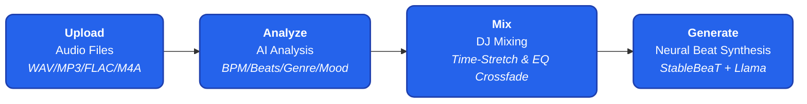
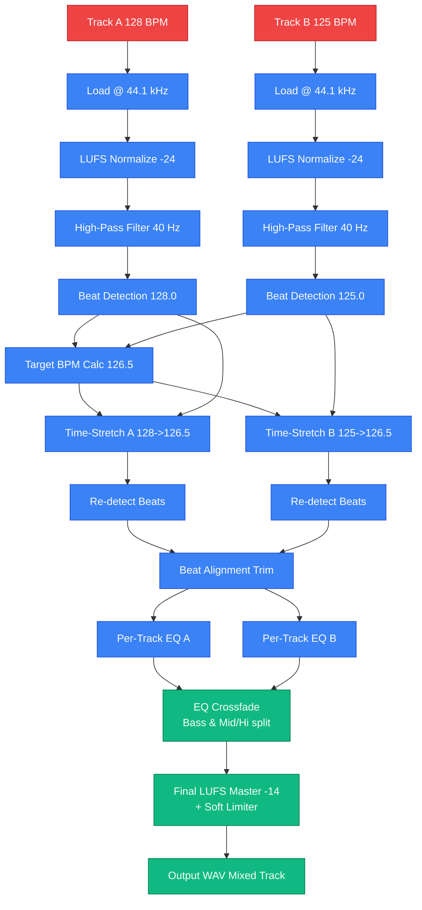
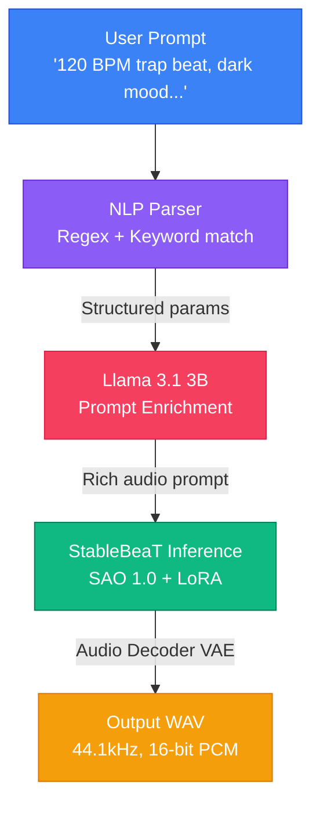
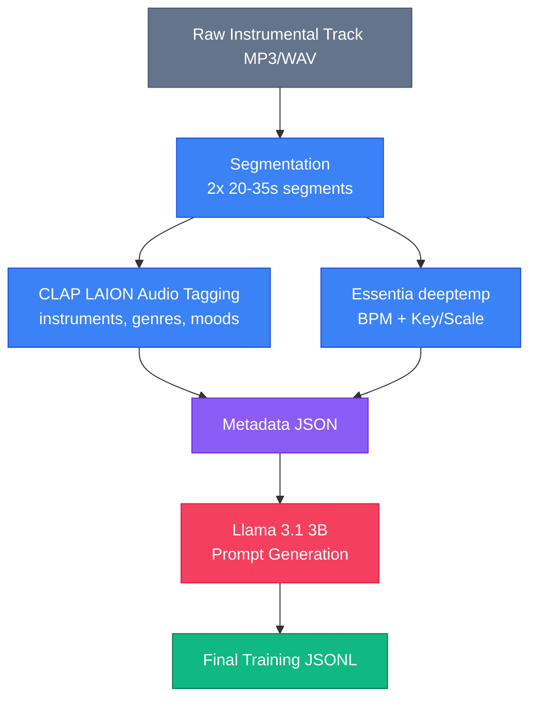

<div align="center">


# 🎛️ AutoMixAI

### AI-Powered Automated DJ Mixing System

> **Beat Detection** • **Genre Classification** • **Instrument Recognition** • **Intelligent Mixing** • **Neural Beat Generation**

*The only DJ that runs on a GPU.*

[🚀 Live Demo](https://huggingface.co/spaces/bharatverse11/AutomixBackend) • [📖 API Docs](#api-reference) • [🧠 Models](#models) • [📦 Installation](#installation) • [🗺️ Roadmap](#roadmap)

---

</div>

## 📋 Table of Contents

1. [Overview](#overview)
2. [Features](#features)
3. [System Architecture](#system-architecture)
4. [Analysis Pipeline](#analysis-pipeline)
5. [DJ Mixing Engine](#dj-mixing-engine)
6. [Beat Generator — StableBeaT](#beat-generator--stablebeat)
7. [Datasets](#datasets)
8. [ML Models](#ml-models)
9. [Feature Extraction](#feature-extraction)
10. [API Reference](#api-reference)
11. [Project Structure](#project-structure)
12. [Installation](#installation)
13. [Configuration](#configuration)
14. [Performance Benchmarks](#performance-benchmarks)
15. [Roadmap](#roadmap)
16. [Acknowledgements](#acknowledgements)

---

## Overview

AutoMixAI is a **full-stack, AI-powered music analysis and DJ mixing platform**. Upload any audio track — the system analyzes BPM, beats, genre, instruments, mood, and tags using a suite of trained neural networks. It can then automatically mix two tracks with beat-aligned, EQ-crossfaded transitions, and generate fully produced, studio-quality beats from a single natural language prompt using **StableBeaT** — a LoRA fine-tune of Stable Audio Open 1.0 trained on 40,000 trap/rap/R&B segments.



---

## Features

### 🔍 Audio Analysis
| Feature | Description | Implementation |
|---|---|---|
| **Beat Detection** | Frame-level beat tracking with ANN | Dense ANN (128→64→1), Ballroom + FMA + MedleyDB |
| **BPM Estimation** | Tempo detection via onset strength | librosa `beat_track`, onset strength analysis |
| **Genre Classification** | 10-class GTZAN classification | Dense (256→128→10), ~78% accuracy |
| **Instrument Recognition** | 11-family NSynth instrument detection | Dense (128→64→11), ~71% accuracy |
| **Music Tagging** | 56 multi-label descriptive tags | Dense (256→128→56), sigmoid, MagnaTagATune |
| **Mood Detection** | Automatic mood inference from tags | Derived from tag_predictor output |
| **Vocal Detection** | Harmonic/percussive separation + HPSS | librosa HPSS + spectral centroid analysis |
| **Energy Analysis** | RMS-based energy classification | low / medium / high tiers |
| **Key & Scale Detection** | Essentia deeptemp key/scale extraction | Confidence threshold > 70% |

### 🎚️ DJ Mixing Engine
- **Beat Alignment** — Automatic beat-grid synchronization across both tracks
- **Pitch-Preserving Time Stretch** — librosa `time_stretch` for tempo matching without pitch distortion
- **LUFS Loudness Normalization** — EBU R128 standard; −24 LUFS pre-mix, −14 LUFS final master
- **High-Pass Filter** — 40 Hz rumble removal via Butterworth filter
- **EQ-Based DJ Crossfade** — Separate bass/mid+high crossfade curves (DJ-style bass swap)
- **Equal-Power Crossfade** — Sin²/cos² S-curve for psychoacoustically smooth transitions
- **Per-Track EQ** — Bass boost (<150 Hz), brightness (>4 kHz), vocal boost (1–4 kHz bandpass)
- **Stereo Panning** — Independent left/right gain per track
- **Soft Limiter** — Prevents digital clipping at output stage

### 🥁 Beat Generation — StableBeaT

AutoMixAI's beat generator is powered by **StableBeaT** — a fine-tuned version of [Stable Audio Open 1.0](https://huggingface.co/stabilityai/stable-audio-open-1.0) trained on 20,000 trap/rap/R&B instrumentals. It moves far beyond pattern-based synthesis to produce full, nuanced, production-ready audio from natural language prompts.

- **Natural Language Prompts** — *"Create a 120 BPM trap beat with heavy 808 bass, dark mood, 4 bars"*
- **Rich Subgenre Coverage** — Cloud trap, lo-fi jazz rap, chillhop, neo-soul, EDM, industrial hip-hop, boom bap
- **Instrumentation Awareness** — Synth bells, plucked bass, deep sub, Rhodes keys, vocal adlibs, 808s, and beyond
- **Key & Mood Conditioning** — Generate in a specific key/scale with targeted emotional character
- **Humanization** — Velocity and timing variations for natural, non-quantized feel
- **Llama Prompt Enrichment** — Llama 3.1 3B expands structured params into rich audio prompts
- **Inference Speed** — ~1 min 15 sec per generation on RTX 4050; 200 steps, CFG scale 7

---

## System Architecture

```mermaid
graph TD
    classDef client fill:#3b82f6,stroke:#1d4ed8,stroke-width:2px,color:#fff;
    classDef api outline:#10b981,fill:#059669,stroke:#047857,stroke-width:2px,color:#fff;
    classDef service fill:#8b5cf6,stroke:#6d28d9,stroke-width:2px,color:#fff;
    classDef ml fill:#f59e0b,stroke:#d97706,stroke-width:2px,color:#fff;

    subgraph ClientLayer [Client Layer - React/Vite]
        direction LR
        Upload[Upload Page]
        Analyze[Analyze Page]
        Mix[Mix Page]
        Beat[Beat Generator]
    end

    subgraph APILayer [API Layer - FastAPI]
        direction LR
        pUpload[POST /upload]
        pAnalyze[POST /analyze]
        pMix[POST /mix]
        pGen[POST /generate]
        pOut[GET /output/id]
    end

    subgraph ServiceLayer [Audio Processing Services]
        direction LR
        sAudio[audio_loader]
        sBeatD[beat_detector]
        sBPM[bpm_estimator]
        sGenre[genre_classifier]
        sInst[instrument_class]
        sTag[tag_predictor]
        sDrum[drum_classifier]
        sBeatG[beat_generator]
        sMixer[mixer]
    end

    subgraph MLLayer [Machine Learning Models]
        mBeat[beat_detector.h5]
        mGenre[genre_classifier.h5]
        mNsynth[nsynth_classifier.h5]
        mTag[tag_predictor.h5]
        mDrum[drum_classifier.h5]
        mStable[stable_beat LoRA]
    end

    ClientLayer -- "HTTP/REST" --> APILayer
    APILayer --> ServiceLayer
    ServiceLayer --> MLLayer

    class ClientLayer client;
    class APILayer api;
    class ServiceLayer service;
    class MLLayer ml;
```



---

## Analysis Pipeline

Every uploaded audio file flows through a unified feature extraction and multi-model inference pipeline:

```
                              ┌─────────────────┐
                              │   Audio File    │
                              │  WAV/MP3/FLAC   │
                              └────────┬────────┘
                                       │
                                       ▼
                              ┌─────────────────┐
                              │  audio_loader   │
                              │  Load @ 22050Hz │
                              │  Normalize peak │
                              └────────┬────────┘
                                       │
                                       ▼
                         ┌─────────────────────────┐
                         │    feature_extractor    │
                         │                         │
                         │   MFCC (13 dims)        │
                         │   Spectral Centroid      │
                         │   Spectral Bandwidth     │
                         │   Spectral Rolloff       │
                         │   Spectral Contrast (7)  │
                         │   Spectral Flatness      │
                         │   Zero Crossing Rate     │
                         │   RMS Energy             │
                         │   Onset Strength         │
                         │   Chroma (12 dims)       │
                         │   Tempo Feature          │
                         │   Beat Sync              │
                         │   Delta MFCC             │
                         │                         │
                         │   → 43-dim feature vec  │
                         └──────────┬──────────────┘
                                    │
       ┌────────────────────────────┼────────────────────────────┐
       │                            │                            │
       ▼                            ▼                            ▼
┌──────────────┐          ┌─────────────────┐          ┌──────────────────┐
│beat_detector │          │genre_classifier │          │instrument_class  │
│              │          │                 │          │                  │
│Input: 43-dim │          │Input: 57-dim    │          │Input: 43-dim     │
│Dense 128→64→1│          │Dense 256→128→10 │          │Dense 128→64→11   │
│Output:P(beat)│          │Output: softmax  │          │Output: softmax   │
└──────┬───────┘          └────────┬────────┘          └────────┬─────────┘
       │                           │                            │
       ▼                           ▼                            ▼
┌──────────────┐          ┌─────────────────┐          ┌──────────────────┐
│bpm_estimator │          │  Top-3 Genres   │          │ Dominant Instr.  │
│              │          │  + Confidence % │          │ + Top-3 w/scores │
│onset_strength│          │                 │          │                  │
│median IBI    │          │ hiphop: 0.87    │          │ keyboard: 0.72   │
│→ BPM float   │          │ pop: 0.08       │          │ bass: 0.15       │
└──────┬───────┘          │ jazz: 0.03      │          │ synth_lead: 0.08 │
       │                  └─────────────────┘          └──────────────────┘
       ▼
┌──────────────┐                   ┌─────────────────────┐
│Beat Timestamps│                  │    tag_predictor    │
│[0.45, 0.92,  │                  │                     │
│ 1.38, 1.85,..│                  │  Input: 43-dim      │
└──────────────┘                  │  Dense 256→128→56   │
                                  │  sigmoid multi-label │
                                  │  threshold: 0.3     │
                                  └──────────┬──────────┘
                                             │
                                  ┌──────────┴──────────┐
                                  ▼                     ▼
                       ┌─────────────────┐   ┌─────────────────┐
                       │  Mood Inference │   │  Vocal Detect.  │
                       │                 │   │                 │
                       │  Derived from   │   │  HPSS spectral  │
                       │  tag activations│   │  harmonic ratio │
                       │  e.g. "calm",   │   │  vocal_ratio    │
                       │  "energetic"    │   │  > 0.8 → vocal  │
                       └────────┬────────┘   └────────┬────────┘
                                │                     │
                                ▼                     ▼
                       ┌─────────────────────────────────────┐
                       │           AnalysisResponse          │
                       │                                     │
                       │  bpm, beat_times, duration,         │
                       │  genre, genre_confidence, genre_top3│
                       │  dominant_instrument, instr_top3    │
                       │  tags, tag_scores, mood,            │
                       │  has_vocals, energy (low/med/high)  │
                       └─────────────────────────────────────┘
```

### Vocal Detection Algorithm

Vocal presence is determined using **Harmonic-Percussive Source Separation (HPSS)**:

```python
# Step 1: Separate harmonic and percussive
y_harmonic, y_percussive = librosa.effects.hpss(y)

# Step 2: Measure energy in vocal frequency range (1–4 kHz)
S = np.abs(librosa.stft(y_harmonic))
vocal_mask = (freqs >= 1000) & (freqs <= 4000)
vocal_ratio = mean_energy(S[vocal_mask]) / mean_energy(S[80Hz+])

# Step 3: Harmonic-to-percussive energy ratio
hp_ratio = mean(y_harmonic²) / mean(y_percussive²)

# Decision rule
has_vocals = (vocal_ratio > 0.8) AND (hp_ratio > 1.2)
```

---

## DJ Mixing Engine

The mixing engine executes a professional 9-step pipeline that mimics real DJ technique:



### EQ Crossfade — Technical Detail

The default crossfade separates each track into frequency bands and fades them independently, preventing bass clashing:

```python
# Split both tracks at 200 Hz boundary
y1_bass    = lowpass_filter(y1_tail, sr, cutoff=200)   # <200 Hz
y1_mid_hi  = highpass_filter(y1_tail, sr, cutoff=200)  # >200 Hz
y2_bass    = lowpass_filter(y2_head, sr, cutoff=200)
y2_mid_hi  = highpass_filter(y2_head, sr, cutoff=200)

t = np.linspace(0, π/2, fade_samples)

# Bass: cubic curves (sharper swap → avoids dual-bass boom)
bass_fade_out = cos(t)³   # Track A bass fades sharply
bass_fade_in  = sin(t)³   # Track B bass enters sharply

# Mid+High: quadratic curves (smoother blend)
hi_fade_out = cos(t)²
hi_fade_in  = sin(t)²

# Recombine: separate bass and mid/high crossfades
mixed = (y1_bass * bass_out + y2_bass * bass_in) \
      + (y1_mid_hi * hi_out + y2_mid_hi * hi_in)
```

This mirrors the technique used by professional DJs who manually EQ the bass frequencies in/out during transitions.

---

## Beat Generator — StableBeaT

StableBeaT is the most technically sophisticated part of AutoMixAI. It goes far beyond procedural pattern generation, using a fine-tuned diffusion model to synthesize full audio.

### Full Generation Pipeline



### StableBeaT Training Details

| Parameter | Value |
|---|---|
| **Base Model** | Stable Audio Open 1.0 (stabilityai) |
| **Fine-tuning Method** | LoRA via LoRAW pipeline |
| **Training Dataset** | 40,000 segments from 20,000 trap/rap/R&B tracks |
| **Total Audio Duration** | ~277 hours |
| **Epochs** | 14 |
| **Steps** | ~35,000 |
| **Batch Size** | 16 |
| **Hardware** | NVIDIA A100 (Google Colab) |
| **Training Time** | ~42 hours |
| **Inference Steps** | 200 (DDIM) |
| **CFG Scale** | 7 |
| **Max Output Duration** | 47 seconds |
| **Inference Time** | ~1m 15s on RTX 4050 Laptop |

### Dataset Annotation Pipeline for StableBeaT

Each training segment is richly tagged before prompts are generated:



### Tag Embedding Clusters (T5-Base)

T5-Base encodes dataset tags into five semantically distinct groups used during training:

| Cluster | Example Tags | Characteristic |
|---|---|---|
| **Emotion** | cheerful, joyful, dreamy, love | Affective/mood vocabulary |
| **Groove** | swing groove, nylon guitar, movie sample | Rhythmic texture |
| **Genre** | g-funk, chill rap beat, jazzy chillhop | Style identifiers |
| **Sonority** | trap vocal, trap guitar | Timbre descriptors |

> **Silhouette Score: 0.095** — clusters are intentionally close, reflecting the semantic density of trap music's vocabulary.

### StableBeaT Generation Examples

All examples generated at 200 steps, CFG scale 7, 47s duration:

| Prompt | Est. BPM | Spec. Centroid | H/P Ratio | CLAP Score |
|---|---|---|---|---|
| Dark melancholic cloud trap, nostalgic piano, plucked bass, synth bells, 110 BPM | 106.13 | 1159.43 | 0.460 | 0.489 |
| Lo-fi jazz rap, 85 BPM, deep sub, plucked bass, vocal chop, chill jazzy mood | 82.72 | 784.82 | 0.457 | 0.429 |
| Melancholic trap, 105 BPM, synth bells, deep sub, minor piano, airy vocal pads | 100.45 | 2540.28 | 1.412 | 0.523 |
| Jazzy chillhop, 101 BPM, synth bells, vocal pad, movie sample, nostalgic mood | 148.02 | 4287.26 | 2.963 | 0.552 |
| Smooth trap, 115 BPM, electric guitar, plucked bass, vocal adlibs, warm pads | 82.72 | 1056.42 | 0.645 | 0.478 |
| Moody cloud trap, 100 BPM, boomy bass, synth bells, melodic piano | 144.20 | 2458.50 | 0.738 | 0.363 |
| Neo-soul R&B, 90 BPM, D major, live bass, soft Rhodes, analog drum grooves | 130.81 | 1000.87 | 0.679 | 0.250 |

**Strengths:**
- Excels on melodic, atmospheric beats with smooth harmonic coherence
- Strong instrument-mood-tempo consistency; outputs feel musically balanced
- Captures nuanced subgenre characteristics (cloud trap, chillhop, neo-soul)

**Current Limitations:**
- Underperforms on underrepresented styles (boom bap, high-energy dense percussion)
- CLAP LAION tagging not specialized for trap/hip-hop → imprecise labeling of snares, hi-hats, 808s
- Melodic elements (piano, synths) can sound quieter than drums due to frequency range differences

---

## Datasets

### Training Datasets Summary

| Dataset | Task | Samples | Classes/Labels | Source |
|---|---|---|---|---|
| **GTZAN** | Genre Classification | 1,000 tracks | 10 genres | Kaggle |
| **NSynth** | Instrument Classification | 305,979 notes | 11 families | Kaggle |
| **MagnaTagATune** | Music Tagging | 25,863 clips | 56 tags | Kaggle |
| **Drum Kit Sounds** | Drum Classification | ~150 samples | 4 classes | Kaggle |
| **Lakh MIDI** | Pattern Extraction | 45,000+ files | Rhythm patterns | Kaggle |
| **Trap/Rap Beats** | StableBeaT fine-tune | 40,000 segments (20k tracks) | Multi-tag | Custom |
| **Ballroom** | Beat Detection | 698 tracks | Beat timestamps | Research |
| **FMA Small** | Beat Detection | 8,000 tracks | Beat timestamps | Research |
| **MedleyDB** | Beat Detection | 122 tracks | Expert annotations | Research |

### GTZAN Genre Collection
```
Purpose:  Genre classification model training
Source:   Kaggle - andradaolteanu/gtzan-dataset-music-genre-classification
Tracks:   1,000 (100 per genre × 10 genres)
Duration: 30 seconds each
Format:   WAV, 22050 Hz mono
Genres:   blues, classical, country, disco, hiphop,
          jazz, metal, pop, reggae, rock
Features: 57-dimensional (chroma, spectral, MFCC)
Model:    Dense 256→128→10, softmax
Accuracy: ~78% (10-class)
```

### NSynth Music Dataset
```
Purpose:  Instrument family classification
Source:   Kaggle - anubhavchhabra/nsynth-music-dataset
Samples:  305,979 musical notes
Duration: 4 seconds each
Format:   TFRecord (parsed to NumPy)
Families: bass, brass, flute, guitar, keyboard, mallet,
          organ, reed, string, synth_lead, vocal
Features: 43-dimensional (MFCC, spectral, chroma)
Model:    Dense 128→64→11, softmax
Accuracy: ~71%
```

### MagnaTagATune Dataset
```
Purpose:  Multi-label music tagging, mood detection, vocal detection
Source:   Kaggle - shrirangmahajan/magnatagatune
Clips:    25,863 audio clips (after filtering)
Duration: ~30 seconds each
Format:   MP3
Labels:   188 original → 56 valid tags (filtered for quality)
Tags:     guitar, piano, drums, female voice, fast, slow,
          rock, electronic, classical, ambient, etc.
Features: 43-dimensional
Model:    Dense 256→128→56, sigmoid (multi-label)
Threshold: 0.3 for tag activation
mAP@10:  ~0.68
```

### Drum Kit Sound Samples
```
Purpose:  Drum hit classification for pattern analysis
Source:   Kaggle - sparshgupta/drum-kit-sound-samples
Samples:  ~150 isolated drum hits
Classes:  kick, snare, hihat, tom
Format:   WAV (studio-quality)
Features: 43-dimensional (onset + spectral focused)
Model:    Dense 64→32→4, softmax
```

### Lakh MIDI Dataset
```
Purpose:  Rhythm pattern extraction for beat generation templates
Source:   Kaggle - federicodellellis/lakh-midi-dataset-clean
Files:    45,000+ MIDI files
Content:  Full songs with drum tracks
Extracted: Drum onset patterns, velocity information
Library:  pretty_midi for parsing
Output:   midi_patterns.pkl (quantized patterns)
```

### Ballroom + FMA Small + MedleyDB (Beat Detection)
```
Ballroom:  698 dance tracks, ~30s each, 9 dance styles
           Beat timestamp annotations from ballroomdancers.com

FMA Small: 8,000 tracks, 30s each, 8 balanced genres
           Beat annotations via librosa

MedleyDB:  122 multitrack studio songs, expert beat annotations
           NYU Music and Audio Research Lab
           Used for fine-tuning on complex professional mixes
```

---

## ML Models

### Model Architectures

#### Beat Detector (`beat_detector.h5`)
```
Input:  43-dim feature vector (per frame)

Dense(128, relu)
Dropout(0.3)
Dense(64, relu)
Dropout(0.3)
Dense(1, sigmoid)

Output: P(beat) ∈ [0, 1]

Training data: Ballroom + FMA Small + MedleyDB
F1-score: ~0.85
```

#### Genre Classifier (`genre_classifier.h5`)
```
Input:  57-dim feature vector

Dense(256, relu)
BatchNormalization
Dropout(0.4)
Dense(128, relu)
BatchNormalization
Dropout(0.4)
Dense(10, softmax)

Output: 10-class probabilities
        [blues, classical, country, disco, hiphop,
         jazz, metal, pop, reggae, rock]

Training: GTZAN (1,000 tracks)
Accuracy: ~78%
```

#### Instrument Classifier (`nsynth_classifier.h5`)
```
Input:  43-dim feature vector

Dense(128, relu)
Dropout(0.3)
Dense(64, relu)
Dropout(0.3)
Dense(11, softmax)

Output: 11-family probabilities
        [bass, brass, flute, guitar, keyboard, mallet,
         organ, reed, string, synth_lead, vocal]

Training: NSynth (305,979 notes)
Accuracy: ~71%
```

#### Tag Predictor (`tag_predictor.h5`)
```
Input:  43-dim feature vector

Dense(256, relu)
Dropout(0.4)
Dense(128, relu)
Dropout(0.4)
Dense(56, sigmoid)

Output: 56 multi-label scores
Activation threshold: 0.3
mAP@10: ~0.68

Training: MagnaTagATune (25,863 clips)
```

#### Drum Classifier (`drum_classifier.h5`)
```
Input:  43-dim feature vector

Dense(64, relu)
Dropout(0.3)
Dense(32, relu)
Dropout(0.3)
Dense(4, softmax)

Output: [kick, snare, hihat, tom] probabilities
Training: Drum Kit Sound Samples (~150 hits)
```

#### StableBeaT (Beat Generator)
```
Base:       Stable Audio Open 1.0 (stabilityai)
Fine-tune:  LoRA via LoRAW pipeline
Dataset:    40,000 trap/rap/R&B segments (~277h)
Epochs:     14
Steps:      ~35,000
Batch size: 16
Hardware:   NVIDIA A100 (Google Colab, ~42h)
Inference:  ~75s on RTX 4050 Laptop GPU
Settings:   200 steps, CFG scale 7, up to 47s
```

---

## Feature Extraction

All audio analysis models share a common 43-dimensional feature vector extracted via librosa:

```python
# Common Parameters
SAMPLE_RATE = 22050   # Hz
HOP_LENGTH  = 1024    # ~46ms per frame
N_FFT       = 2048
N_MELS      = 128
N_MFCC      = 20

# 43-Dimensional Feature Vector
features = np.concatenate([
    mfcc[0:13],                  # 13 dims — Timbre representation
    [spectral_centroid],         #  1 dim  — Perceived brightness
    [spectral_bandwidth],        #  1 dim  — Spectral spread
    [spectral_rolloff],          #  1 dim  — High-frequency energy threshold
    spectral_contrast[0:7],      #  7 dims — Harmonic structure (valley/peak)
    [spectral_flatness],         #  1 dim  — Noise vs tonal content
    [zero_crossing_rate],        #  1 dim  — Percussive/noisy content indicator
    [rms_energy],                #  1 dim  — Loudness / energy
    [onset_strength],            #  1 dim  — Transient detection
    chroma[0:12],                # 12 dims — Pitch class distribution
    [tempo_feature],             #  1 dim  — BPM context
    [beat_sync],                 #  1 dim  — Beat alignment score
    [delta_mfcc[0]],             #  1 dim  — First-order temporal change
])
# Total: 13+1+1+1+7+1+1+1+1+12+1+1+1 = 43 dimensions
```

The genre classifier uses a 57-dimensional variant that includes additional chroma and spectral features.

---

## API Reference

### Base URL
```
Production: https://bharatverse11-automixbackend.hf.space
Local:      http://localhost:8002
```

### Endpoints Summary

| Method | Endpoint | Description | Auth |
|---|---|---|---|
| `GET` | `/` | Service info & health | None |
| `GET` | `/health` | Health check | None |
| `POST` | `/upload` | Upload audio file → file_id | None |
| `POST` | `/analyze` | Analyze audio (BPM, genre, mood, etc.) | None |
| `POST` | `/mix` | Mix two uploaded tracks | None |
| `POST` | `/generate` | Generate procedural drum beat | None |
| `POST` | `/generate-ai` | Generate beat via MusicGen AI | HF_TOKEN optional |
| `POST` | `/recognize` | Identify song via Shazam | RAPIDAPI_KEY |
| `GET` | `/output/{file_id}` | Download generated WAV | None |

---

### `POST /upload`

Upload an audio file and receive a `file_id` for subsequent operations.

**Request:**
```bash
curl -X POST "http://localhost:8002/upload" \
  -H "Content-Type: multipart/form-data" \
  -F "file=@track.mp3"
```

**Supported formats:** `.wav` `.mp3` `.flac` `.ogg` `.m4a` `.aac`

**Response:**
```json
{
  "file_id": "a3f8b2c1d4e5f6a7b8c9d0e1f2a3b4c5",
  "filename": "track.mp3",
  "duration": 213.45,
  "message": "File uploaded successfully."
}
```

---

### `POST /analyze`

Run the full AI analysis pipeline on an uploaded track.

**Request:**
```json
{
  "file_id": "a3f8b2c1d4e5f6a7b8c9d0e1f2a3b4c5"
}
```

**Response:**
```json
{
  "file_id": "a3f8b2c1d4e5f6a7b8c9d0e1f2a3b4c5",
  "bpm": 128.5,
  "beat_times": [0.45, 0.92, 1.38, 1.85, 2.32],
  "duration": 213.45,
  "sample_rate": 22050,
  "genre": "hiphop",
  "genre_confidence": 0.87,
  "genre_top3": [
    { "genre": "hiphop", "confidence": 0.87 },
    { "genre": "pop",    "confidence": 0.08 },
    { "genre": "jazz",   "confidence": 0.03 }
  ],
  "dominant_instrument": "keyboard",
  "instrument_confidence": 0.72,
  "instruments_top3": [
    { "instrument": "keyboard",   "confidence": 0.72 },
    { "instrument": "bass",       "confidence": 0.15 },
    { "instrument": "synth_lead", "confidence": 0.08 }
  ],
  "tags": ["piano", "drums", "slow", "ambient"],
  "tag_scores": [
    { "tag": "piano",  "score": 0.89 },
    { "tag": "drums",  "score": 0.76 },
    { "tag": "slow",   "score": 0.61 },
    { "tag": "ambient","score": 0.55 }
  ],
  "mood": "calm",
  "has_vocals": false,
  "energy": "medium",
  "message": "Analysis complete."
}
```

---

### `POST /mix`

Mix two uploaded audio tracks with the advanced DJ mixing engine.

**Request:**
```json
{
  "file_id_a": "file-id-of-track-a",
  "file_id_b": "file-id-of-track-b",
  "crossfade_duration": 8.0,
  "bass_boost": 0.2,
  "brightness": 0.1,
  "vocal_boost": 0.0,
  "pan_a": -0.1,
  "pan_b": 0.1,
  "eq_transition": true
}
```

**Parameters:**

| Field | Type | Default | Description |
|---|---|---|---|
| `file_id_a` | string | required | Track A file ID |
| `file_id_b` | string | required | Track B file ID |
| `crossfade_duration` | float | `8.0` | Crossfade length in seconds |
| `bass_boost` | float | `0.0` | Bass frequency boost (0–1) |
| `brightness` | float | `0.0` | High-frequency boost (0–1) |
| `vocal_boost` | float | `0.0` | Mid-frequency (vocal) boost (0–1) |
| `pan_a` | float | `0.0` | Track A stereo pan (−1 left → +1 right) |
| `pan_b` | float | `0.0` | Track B stereo pan |
| `eq_transition` | bool | `true` | Use EQ-based DJ crossfade (vs equal-power) |

**Response:**
```json
{
  "output_file_id": "mix-xyz789abc123",
  "duration": 427.8,
  "bpm_a": 128.0,
  "bpm_b": 125.0,
  "target_bpm": 126.5,
  "message": "Mix generated successfully."
}
```

---

### `POST /generate`

Generate a procedural drum beat from a natural language prompt using the rule-based synthesizer.

**Request:**
```json
{
  "prompt": "dark trap beat 140 BPM intricate 8 bars",
  "bars": 8
}
```

**Supported genre keywords:** `hip hop`, `rap`, `trap`, `drill`, `phonk`, `house`, `deep house`, `techno`, `dnb`, `drum and bass`, `rock`, `punk`, `metal`, `pop`, `jazz`, `swing`, `reggae`, `dub`, `funk`, `disco`, `ambient`, `chill`

**Response:**
```json
{
  "output_file_id": "beat-abc123def456",
  "genre": "trap",
  "bpm": 140.0,
  "bars": 8,
  "complexity": "complex",
  "description": "Dark intense Trap beat at 140 BPM, 8 bars",
  "duration": 13.714,
  "pattern": {
    "kick":     [1,0,0,0,0,0,1,0,0,0,1,0,0,0,0,0],
    "snare":    [0,0,0,0,1,0,0,0,0,0,0,0,1,0,0,0],
    "hihat_c":  [1,1,1,1,1,1,1,1,1,1,1,1,1,1,1,1],
    "hihat_o":  [0,0,0,0,0,0,0,1,0,0,0,0,0,0,0,1],
    "clap":     [0,0,0,0,1,0,0,0,0,0,0,0,1,0,0,0]
  },
  "sample_rate": 44100,
  "message": "Beat generated successfully."
}
```

---

### `POST /generate-ai`

Generate a full beat using **Meta's MusicGen Small** via HuggingFace Inference API.

**Request:**
```json
{
  "prompt": "A dark 808 trap beat with rolling hi-hats and heavy bass",
  "duration": 15
}
```

| Field | Type | Range | Description |
|---|---|---|---|
| `prompt` | string | 3–500 chars | Natural language music description |
| `duration` | int | 3–30 sec | Target output duration |

**Response:**
```json
{
  "output_file_id": "ai-beat-xyz987",
  "prompt": "A dark 808 trap beat with rolling hi-hats and heavy bass",
  "duration": 14.92,
  "model": "facebook/musicgen-small",
  "sample_rate": 32000,
  "message": "AI beat generated successfully."
}
```

---

### `POST /recognize`

Identify a song using the Shazam Core API (requires `RAPIDAPI_KEY` environment variable).

**Request:** `multipart/form-data` with audio file (any format, min 500 bytes)

**Response (found):**
```json
{
  "status": "found",
  "title": "HUMBLE.",
  "artist": "Kendrick Lamar",
  "album": "DAMN.",
  "cover": "https://is1-ssl.mzstatic.com/image/...",
  "year": "2017",
  "spotify": "spotify:track:7KXjTSCq5nL1LoYtL7XAwS",
  "apple_music": "https://music.apple.com/...",
  "shazam_url": "https://www.shazam.com/track/...",
  "score": 3,
  "source": "shazam",
  "match_quality": "high",
  "is_early": true
}
```

---

### `GET /output/{file_id}`

Download a generated mix or beat as a WAV file.

```bash
curl -O "http://localhost:8002/output/mix-xyz789abc123"
# Returns: automix_mix-xyz789abc123.wav
```

---

## Project Structure

```
AutoMixAI/
│
├── backend/                          # FastAPI Backend
│   └── app/
│       ├── main.py                   # Application entry point + CORS
│       │
│       ├── routes/                   # API Endpoint handlers
│       │   ├── upload.py             # POST /upload
│       │   ├── analyze.py            # POST /analyze
│       │   ├── mix.py                # POST /mix
│       │   └── generate.py           # POST /generate + /generate-ai
│       │
│       ├── schemas/                  # Pydantic request/response models
│       │   ├── analysis_response.py  # AnalysisResponse, TagScore, etc.
│       │   └── generate_request.py   # GenerateRequest, GenerateBeatRequest
│       │
│       ├── services/                 # Core business logic
│       │   ├── audio_loader.py       # librosa load, peak normalize
│       │   ├── beat_detector.py      # ANN inference, frame-to-time
│       │   ├── bpm_estimator.py      # Onset strength → BPM
│       │   ├── feature_extractor.py  # 43-dim feature vector extraction
│       │   ├── genre_classifier.py   # GTZAN model inference
│       │   ├── instrument_classifier.py  # NSynth model inference
│       │   ├── tag_predictor.py      # MagnaTagATune multi-label
│       │   ├── drum_classifier.py    # Drum hit classification
│       │   ├── beat_generator.py     # StableBeaT + Llama pipeline
│       │   └── mixer.py              # DJ mixing engine (9-step)
│       │
│       ├── model/                    # ML infrastructure
│       │   ├── ann_model.py          # Dense ANN architecture definitions
│       │   ├── train.py              # Training script (beat detector)
│       │   ├── inference.py          # Model loading + inference wrapper
│       │   └── stable_beat/          # StableBeaT LoRA weights + config
│       │       ├── config.json
│       │       ├── lora_weights.safetensors
│       │       └── model_config.json
│       │
│       ├── data/                     # Dataset processing
│       │   ├── prepare_data.py       # Raw datasets → X.npy / y.npy
│       │   └── medleydb_loader.py    # MedleyDB multitrack loader
│       │
│       ├── utils/                    # Shared utilities
│       │   ├── config.py             # pydantic-settings env config
│       │   ├── logger.py             # Structured logging
│       │   └── helpers.py            # UUID generation, file ops
│       │
│       └── storage/                  # File storage
│           ├── uploads/              # Temp uploaded audio files
│           ├── output/               # Generated mixes & beats (WAV)
│           └── models/               # Trained weights
│               ├── beat_detector.h5
│               ├── feature_scaler.pkl
│               ├── genre_classifier.h5
│               ├── genre_scaler.pkl
│               ├── nsynth_classifier.h5
│               ├── nsynth_scaler.pkl
│               ├── nsynth_labels.pkl
│               ├── tag_predictor.h5
│               ├── tag_scaler.pkl
│               ├── tag_labels.pkl
│               ├── drum_classifier.h5
│               ├── drum_scaler.pkl
│               ├── midi_patterns.pkl
│               └── stable_beat/      # StableBeaT LoRA checkpoint
│
├── frontend/                         # React 18 Frontend
│   ├── index.html
│   ├── vite.config.js
│   ├── package.json
│   └── src/
│       ├── main.jsx                  # React entry point
│       ├── App.jsx                   # Router + layout
│       ├── api.js                    # Centralized API client
│       ├── index.css                 # Global styles
│       ├── components/               # Shared UI components
│       │   ├── WaveformPlayer.jsx    # WaveSurfer.js waveform display
│       │   ├── StatCard.jsx          # Analysis metric card
│       │   └── GenreBar.jsx          # Genre probability bar chart
│       └── pages/                    # Route pages
│           ├── UploadPage.jsx        # Drag-and-drop file upload
│           ├── AnalyzePage.jsx       # Full analysis display
│           ├── MixPage.jsx           # Two-track mixer UI
│           └── BeatGeneratorPage.jsx # Prompt + generation UI
│
├── notebooks/                        # Training notebooks (Kaggle)
│   └── kaggle/
│       ├── GenreClassifier_Training.ipynb
│       └── MultiTask_Audio_Training.ipynb
│
├── Datasets/                         # Local training data (gitignored)
│   ├── BallroomAnnotations/
│   ├── BallroomData/
│   ├── fma_small/
│   └── medleydb/
│
├── Dockerfile                        # HuggingFace Spaces deployment
├── requirements.txt
└── README.md
```

---

## Installation

### Prerequisites

| Dependency | Version | Purpose |
|---|---|---|
| Python | 3.10+ | Backend runtime |
| Node.js | 18+ | Frontend build |
| FFmpeg | any | Audio format conversion |
| CUDA GPU | recommended | StableBeaT inference |

### Backend Setup

```bash
# 1. Clone the repository
git clone https://github.com/garvbahl37-gif/AutoMixAi.git
cd AutoMixAi

# 2. Create and activate virtual environment
python -m venv venv
source venv/bin/activate        # Linux/Mac
# venv\Scripts\activate         # Windows

# 3. Install Python dependencies
pip install -r requirements.txt

# 4. Place model weights in backend/app/storage/models/
# ANN models: .h5 and .pkl files
# StableBeaT: LoRA checkpoint in stable_beat/

# 5. Set environment variables (optional)
export RAPIDAPI_KEY="your_rapidapi_key"   # For Shazam recognition
export HF_TOKEN="your_hf_token"           # For MusicGen AI generation
```

### Frontend Setup

```bash
cd frontend
npm install
npm run dev
```

### Running Locally

```bash
# Terminal 1 — Backend
cd backend
uvicorn app.main:app --reload --port 8002

# Terminal 2 — Frontend
cd frontend
npm run dev
```

Access at **http://localhost:5173** (frontend) and **http://localhost:8002/docs** (Swagger API docs)

### HuggingFace Spaces Deployment

The backend is Dockerized and deployed as a HuggingFace Space:

```dockerfile
FROM python:3.10-slim
RUN apt-get update && apt-get install -y ffmpeg libsndfile1
WORKDIR /app
COPY requirements.txt .
RUN pip install -r requirements.txt
COPY . .
EXPOSE 7860
CMD ["uvicorn", "app:app", "--host", "0.0.0.0", "--port", "7860"]
```

### Training the ANN Models

```bash
# Step 1: Prepare beat detection training data
python -m backend.app.data.prepare_data

# Step 2: Train the beat detector
python -m backend.app.model.train

# Step 3: Genre + multi-task models (run on Kaggle GPU)
# Open: notebooks/kaggle/GenreClassifier_Training.ipynb
# Open: notebooks/kaggle/MultiTask_Audio_Training.ipynb
```

---

## Configuration

All environment variables use the `AUTOMIX_` prefix (via pydantic-settings):

| Variable | Default | Description |
|---|---|---|
| `AUTOMIX_SAMPLE_RATE` | `22050` | Audio sample rate for analysis |
| `AUTOMIX_HOP_LENGTH` | `512` | STFT hop length (training) |
| `AUTOMIX_MODEL_PATH` | `storage/models/beat_detector.h5` | Beat detector model path |
| `AUTOMIX_GENRE_MODEL_PATH` | `storage/models/genre_classifier.h5` | Genre classifier path |
| `AUTOMIX_STABLE_BEAT_PATH` | `storage/models/stable_beat/` | StableBeaT LoRA checkpoint |
| `AUTOMIX_DEBUG` | `false` | Enable verbose debug logging |
| `RAPIDAPI_KEY` | `""` | RapidAPI key for Shazam recognition |
| `HF_TOKEN` | `""` | HuggingFace token for MusicGen inference |

---

## Performance Benchmarks

| Task | Metric | Score |
|---|---|---|
| Beat Detection | F1-score | ~0.85 |
| BPM Estimation | Accuracy (±2 BPM tolerance) | ~92% |
| Genre Classification | Accuracy (10-class GTZAN) | ~78% |
| Instrument Classification | Accuracy (11-class NSynth) | ~71% |
| Tag Prediction | mAP@10 | ~0.68 |
| StableBeaT Generation | CLAP Prompt Alignment Score (avg) | ~0.44 |
| StableBeaT Inference | Time per beat (RTX 4050) | ~75 seconds |
| EQ Crossfade Mixing | Processing time (2×3min tracks) | ~8–15 seconds |

---

## Tech Stack

| Layer | Technology |
|---|---|
| **Frontend** | React 18, Vite, WaveSurfer.js, Lucide Icons |
| **Backend** | FastAPI, Uvicorn, Pydantic v2 |
| **ML / ANN** | TensorFlow / Keras, scikit-learn, NumPy |
| **Beat Generation** | Stable Audio Open 1.0, LoRAW, Stable Audio Tools |
| **Prompt Enrichment** | Llama 3.1 3B (local inference) |
| **Audio Tagging** | CLAP LAION model |
| **Feature Extraction** | librosa, Essentia |
| **Audio I/O** | soundfile, pyrubberband |
| **Loudness Normalization** | pyloudnorm (EBU R128) |
| **Song Recognition** | Shazam Core API (RapidAPI), httpx |
| **Deployment** | HuggingFace Spaces (Docker) |
| **Storage** | File-based (uploads/, output/) |

---

## Roadmap

- [ ] Real-time streaming audio analysis
- [ ] Key detection for harmonic mixing (Camelot Wheel support)
- [ ] Energy-based automatic track ordering
- [ ] Playlist-level intelligent mixing (multi-track)
- [ ] Reinforcement learning DJ transition optimizer
- [ ] Trap-specialized CLAP model for improved StableBeaT tagging
- [ ] StableBeaT v2 — fine-tuning on underrepresented styles (boom bap, high-energy)
- [ ] SpecGrad-style noise conditioning for beat generation
- [ ] Mobile app (React Native)
- [ ] Cloud deployment (AWS/GCP)
- [ ] WebSocket-based real-time collaboration mixing
- [ ] VST plugin interface for DAW integration

---

## Acknowledgements

| Library / Resource | Role |
|---|---|
| [librosa](https://librosa.org) | Core audio analysis & feature extraction |
| [TensorFlow / Keras](https://tensorflow.org) | ANN model training & inference |
| [FastAPI](https://fastapi.tiangolo.com) | High-performance async web framework |
| [Stable Audio Open 1.0](https://huggingface.co/stabilityai/stable-audio-open-1.0) | Generative audio foundation model for StableBeaT |
| [LoRAW](https://github.com/NeuralNotW0rk/LoRAW) | LoRA fine-tuning pipeline for Stable Audio Open |
| [Stable Audio Tools](https://github.com/Stability-AI/stable-audio-tools) | Official Stability AI audio framework |
| [Essentia](https://essentia.upf.edu/models.html) | Key/scale & deeptemp BPM detection |
| [pyloudnorm](https://github.com/csteinmetz1/pyloudnorm) | EBU R128 loudness normalization |
| [GTZAN Dataset](https://www.kaggle.com/datasets/andradaolteanu/gtzan-dataset-music-genre-classification) | Genre classification training |
| [NSynth Dataset](https://magenta.tensorflow.org/datasets/nsynth) | Instrument classification training |
| [MagnaTagATune](https://mirg.city.ac.uk/codeapps/the-magnatagatune-dataset) | Multi-label music tagging |
| [Shazam Core API](https://rapidapi.com/shazam/api/shazam-core) | Song recognition |
| [WaveSurfer.js](https://wavesurfer.xyz) | Frontend waveform visualization |
| [Llama 3.1 3B](https://ai.meta.com/blog/meta-llama-3-1/) | Prompt enrichment for beat generation |
| [CLAP LAION](https://github.com/LAION-AI/CLAP) | Audio-language contrastive tagging |

---

## License

MIT License — see `LICENSE` for details.

---

<div align="center">

**Built with 🎵 and too many GPU hours**

*Star this repo if AutoMixAI helped you ship something cool.*

</div>
